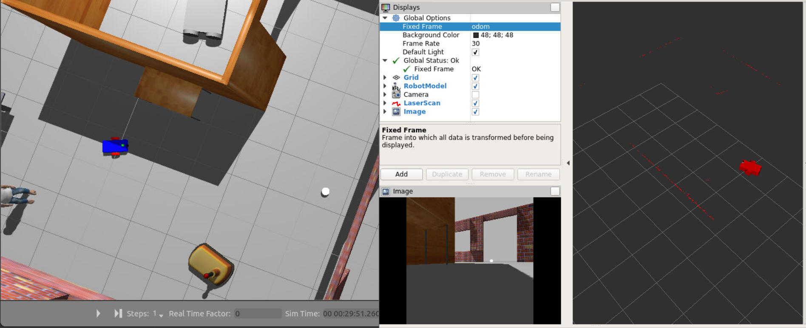
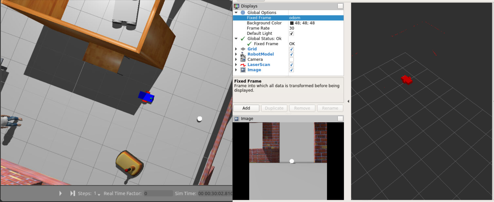
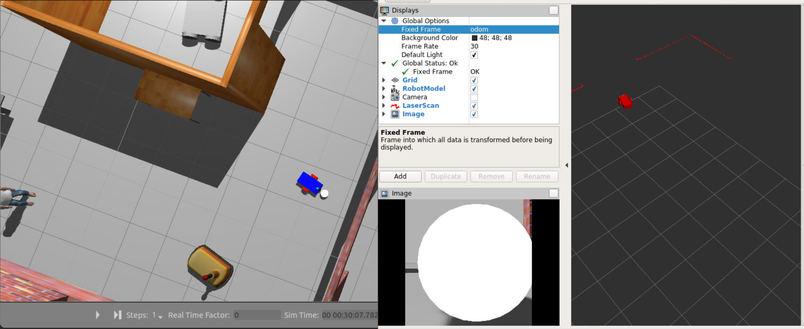

# chase_ball
Robot which detects and chases a white-coloured ball using camera and lidar sensors. 

## Structure

The repository contains two packages as follows. 

### my_robot

This package holds a robot, a white ball, and the surrounding world. The robot is a differential drive robot designed with URDF (Unified Robot Description Format). A Gazebo plugin controls the robot’s differential drive as well as the camera and lidar sensors which are used to detect the white ball. 

### ball_chaser

This package contains two nodes responsible for detecting the ball and driving towards it. The process_image node analyses the robot's camera image to detect the presence and location of the white ball. If a ball exists, the node requests a service via the client to drive the robot towards it. The drive_bot node provides a service to drive the robot by controlling its linear and angular velocities. 

## Screenshots







## Building
Prerequisites/Dependencies: [Gazebo](http://gazebosim.org/) and ROS. 

With the prerequisites met, source global ros: 
```
$ source /opt/ros/<your_ros_version>/setup.bash
```
Create a catkin workspace:
```
$ mkdir -p catkin_ws/src && cd catkin_ws
```
Clone the driver:
```
$ git clone https://github.com/mulbarry/gazebo_world.git src/gazebo_world
```
Install dependencies:
```
$ sudo apt update -qq
$ rosdep update
$ rosdep install --from-paths src --ignore-src -y
```
Build the workspace:
```
$ catkin_make
```
Activate the workspace:
```
$ source devel/setup.bash
```
Launch the world file in Gazebo:
```
$ roslaunch my_robot world.launch
```
Open a new terminal and launch the nodes to detect and chase the white ball: 
```
$ cd catkin_ws
$ source devel/setup.bash
$ roslaunch ball_chaser ball_chaser.launch
```

## Directory Structure
    .Project                           # Chase Ball Project
    ├── my_robot                       # my_robot package                   
    │   ├── launch                     # launch folder for launch files   
    │   │   ├── robot_description.launch
    │   │   ├── world.launch
    │   ├── meshes                     # meshes folder for sensors
    │   │   ├── hokuyo.dae
    │   ├── urdf                       # urdf folder for xarco files
    │   │   ├── my_robot.gazebo
    │   │   ├── my_robot.xacro
    │   ├── worlds                     # world folder for world files
    │   │   ├── myworld.world
    │   ├── CMakeLists.txt             # compiler instructions
    │   ├── package.xml                # package info
    ├── ball_chaser                    # ball_chaser package                   
    │   ├── launch                     # launch folder for launch files   
    │   │   ├── ball_chaser.launch
    │   ├── src                        # source folder for C++ scripts
    │   │   ├── drive_bot.cpp
    │   │   ├── process_images.cpp
    │   ├── srv                        # service folder for ROS services
    │   │   ├── DriveToTarget.srv
    │   ├── CMakeLists.txt             # compiler instructions
    │   ├── package.xml                # package info                  
    └──                              
